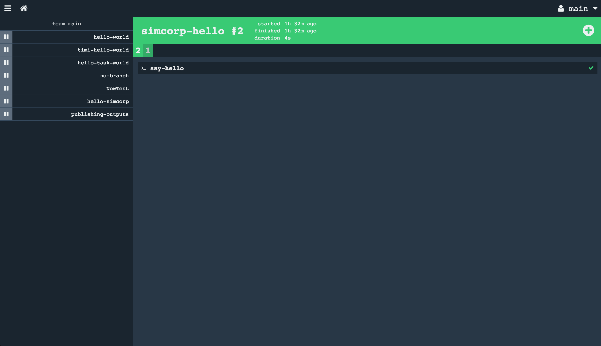

# Running a pipeline in Concourse

The pipelines live in config files right next to your code. This way the config is committed along with your code in your version control system.

## Setup

### Download
To create a pipeline on your server (which in our case for the demo is http://138.68.100.7:8080/) you need a way to configure your pipeline. We use fly cli for that. Fly cli is a command line tool that puts your configuration on Concourse. You can get it from the server itself.
- Go on http://138.68.100.7:8080/
- login (u:concourse, pw:changeme)
- download the cli from the right bottom 3 different ones for different OS-es

For further info you can read on here: https://concourse.ci/downloads.html
https://concourse.ci/fly-cli.html

### Set target

To address a command to a specific server with fly cli, you need to set a target on it.

You can do that with the following command

- `fly --target conc-test login  --concourse-url http://138.68.100.7:8080`

Let's break down this command.

- fly : the exe file you downloaded
- --target : setting an alias for the server, conc-test in this case
- login : will ask for login credentials as a user input after you ran the command (the same that is given in the download section)
- --concourse-url : the url of the server

## Create pipeline

In the local clone of your git repo containing your work, create a pipeline folder where you will place your pipeline description file (hello-simcorp.yml). We have done this for you in the https://github.com/SimCorpTrial/concourse-test-target.git repo.

(
  _If you are following along with this description, make a copy of the hello-simcorp.yml and put your initials in the name of the file so we can all work on different files. Please remember to change not just the name of the file, but inside the file the name of the job. You can also change the name of the task, that is optional._

)

- cd into the folder your config file is
- run the following command to put/update your pipeline on the server

  - `fly -t conc-test set-pipeline -p hello-simcorp -c hello-simcorp.yml`

(also remember to change the name of the pipeline and the name of the file in the command above if you are following along)

### Unpause the pipeline

When a pipeline is initally created, it is paused. To unpause the pipeline, run
  - `fly -t conc-test unpause-pipeline -p hello-simcorp`

## Checkout your pipeline

To see the effect of your making on the server, go on http://138.68.100.7:8080/. Log in (right up corner) with the same credentials before. You will see something like this. Click the burger menu on the top left to see the pipelines created on our server.

You will see something like this.

On click on hello-simcorp you will see the pipeline created under that name. It has only one element, as it is running only one task.

When you click the green rectangle, you will see this.

The numbers show the builds. When you click them, you get the output of the build under. This very simple pipeline has only one task that is called say-hello. You can click that in the UI and it will show you the output of that single task.

## Workshop time!

Alright! Now you can see the basic setup of Concourse.

Here comes the workshop. There is a really good set of exercises you can take a look at here: https://github.com/starkandwayne/concourse-tutorial

The rest of the time you can use to get your feet wet with Concourse. What you do is the following:

- Clone the repo above
- You can skip spinning up Concourse in vagrant. Use the one we prepared for you on http://138.68.100.7:8080/
- Create and run the pipelines with your initials in it. As everyone is using the same Concourse going through the same repo, if you use the same names, you will keep overwriting the same pipelines.

You can find a video walkthrough from the creators of the tutorial here https://www.youtube.com/watch?v=m_KpkupKITc .

Happy hacking!

You can find the slides of Lars here

http://code.praqma.com/reveals/the-future-pipeline/#/

You can find the slides of Jan here

https://docs.google.com/presentation/d/1X2k83JdH4ck59cnqU5hALuUflQJxwgpzcB6jvpg9Qyg/edit?usp=sharing
